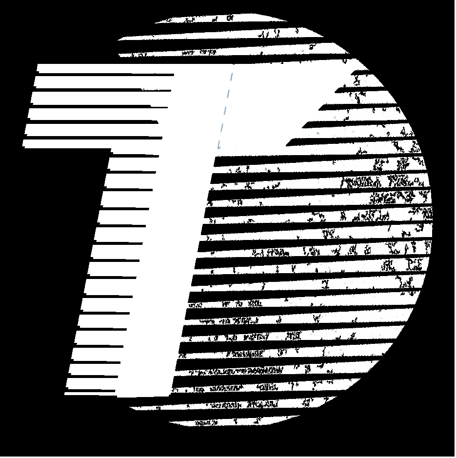

# Logos
<ul>
<li>Repository for Trilinos project logos and other images.
<li>Trilinos_black.jpg: this is the logo but in black and white.
<li>Trilinos_logo.jpg: this is the logo.
<li>Trilinos_square.jpg: this is the square version of the logo.
<li>Trilinos_square_black.jpg: this is the square, black version of the logo.
<li>All the file with transparent are just png file with the frame, the wording of the logo will take on the color of the back ground.
</ul>

# Thumbnails
<Table>
  <TR>
    <TH>Logo</TH>
    <TH>Thumbnail</TH>
  </TR>
  <TR>
    <TD>Trilinos_black.jpg</TD>
    <TD></TD>
  </TR>
  <TR>
    <TD>Trilinos_logo.jpg</TD>
    <TD></TD>
  </TR>
  <TR>
    <TD>Trilinos_logo_square.jpg</TD>
    <TD></TD>
  </TR>
  <TR>
    <TD>Trilinos_logo_square_black.jpg</TD>
    <TD></TD>
  </TR>
  <TR>
    <TD>Trilinos_logo_square_transparant_black.png</TD>
    <TD></TD>
  </TR>
  <TR>
    <TD>Trilinos_logo_square_transparant_blue.png</TD>
    <TD></TD>
  </TR>
  <TR>
    <TD>Trilinos_logo_transparant_black.png</TD>
    <TD></TD>
  </TR>
  <TR>
    <TD>Trilinos_logo_transparant_blue.png</TD>
    <TD></TD>
  </TR>
</Table>

  
  
