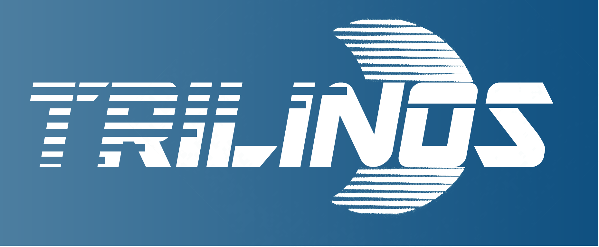

# Trilinos Logos

### Background
In Fall 2017 the Trilinos Projected updated its logo system to the logo family shown below.  When you communicate about the Trilinos Project, please use the following images instead of any of the old logos.

### Usage Preference

<ol>
<li> In most settings Trilinos_logo.jpg or Trilinos_logo.png will be the correct choice.
<li> If you want to use a symbolic or iconic reference, you can use Trilinos_logo_square.jpg or the .png version.
<li> If you want black-and-white versions, Trilinos_logo_black_* are available.
<li> Finally, if you want the logo in front of a background or other image, the final four images have a transparent "white space".
</ol>

# Thumbnails
<Table>
  <TR>
    <TH>Logo</TH>
    <TH>Thumbnail</TH>
  </TR>
  <TR>
    <TD>Trilinos_logo.jpg</TD>
    <TD></TD>
  </TR>
  <TR>
    <TD>Trilinos_logo.png</TD>
    <TD></TD>
  </TR>
  <TR>
    <TD>Trilinos_logo_square.jpg</TD>
    <TD></TD>
  </TR>
  <TR>
    <TD>Trilinos_logo_square.png</TD>
    <TD></TD>
  </TR>
  <TR>
    <TD>Trilinos_black.jpg</TD>
    <TD></TD>
  </TR>
  <TR>
    <TD>Trilinos_black.png</TD>
    <TD></TD>
  </TR>
  <TR>
    <TD>Trilinos_logo_square_black.jpg</TD>
    <TD></TD>
  </TR>
  <TR>
    <TD>Trilinos_logo_square_black.png</TD>
    <TD></TD>
  </TR>
  <TR>
    <TD>Trilinos_logo_square_transparant_black.png</TD>
    <TD></TD>
  </TR>
  <TR>
    <TD>Trilinos_logo_square_transparant_blue.png</TD>
    <TD></TD>
  </TR>
  <TR>
    <TD>Trilinos_logo_transparant_black.png</TD>
    <TD></TD>
  </TR>
  <TR>
    <TD>Trilinos_logo_transparant_blue.png</TD>
    <TD></TD>
  </TR>
</Table>

  
  
